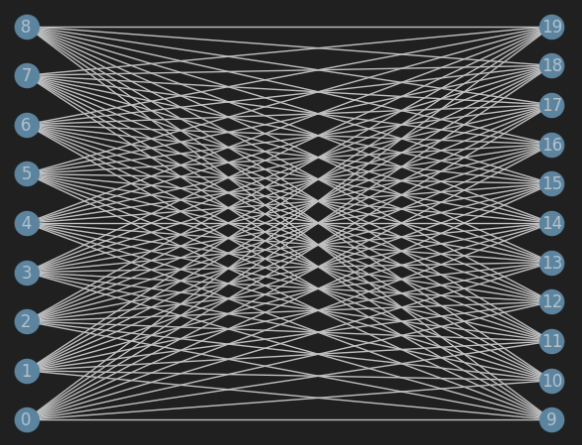
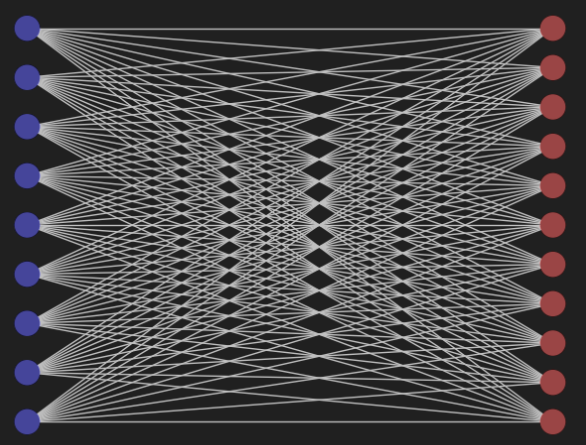

# QuantumMaxCut

QuantumMaxCut is a quantum-inspired algorithm implementation for solving the Max-Cut problem using various quantum computing techniques and frameworks. The project demonstrates the usage of quantum optimization methods, such as the Quantum Approximate Optimization Algorithm (QAOA), for classical combinatorial problems like Max-Cut.

## Introduction

The Max-Cut problem is a well-known problem in combinatorial optimization. It involves dividing a graph's vertices into two disjoint subsets such that the sum of the weights of the edges between the two subsets is maximized.

QuantumMaxCut provides an implementation of quantum-inspired algorithms, specifically QAOA, to solve the Max-Cut problem on classical computers using quantum simulators and, potentially, on actual quantum hardware. This algorithm is designed to work efficiently with graphs consisting of `n` nodes.

## Graph Visualization

Below are visualizations of a sample graph before and after applying the Max-Cut algorithm:

### Graph Before Max-Cut

### Graph After Max-Cut (Colored)

In the "before" image, the graph is shown in its initial state. After running the Max-Cut algorithm, the graph is colored to indicate the two partitions where the edges between them are maximized.
